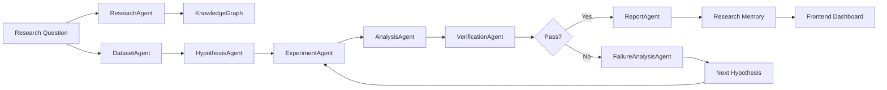

# NOVIA — AI Research Laboratory

A self-evolving multi-agent research system designed to turn a research question into a structured, testable experiment pipeline. NOVIA combines literature discovery, synthetic or real dataset generation, hypothesis creation, model comparison, statistical evaluation, verification, and conversational reasoning across specialized AI agents.

> Project identity: Novel Orchestrated Virtual Intelligence Architecture

## Overview

NOVIA is a research orchestration platform built around a multi-agent workflow. Instead of relying on a single model to answer everything, it distributes the work across specialized agents:

- a research agent for literature gathering
- a dataset agent for data generation
- a hypothesis agent for proposal and iteration
- an experiment agent for model evaluation
- an analysis agent for interpretation
- a verification agent for quality checks
- a reporting agent for conclusions
- a debate/failure analysis layer for critique and iterative refinement

This makes NOVIA useful as a prototype for autonomous scientific experimentation, benchmarking, and AI-assisted research pipelines.

## Why NOVIA?

The project follows a practical research loop:

1. Receive a question
2. Search literature
3. Build or generate a dataset
4. Form a hypothesis
5. Run controlled experiments
6. Compare models with standard metrics
7. Verify results independently
8. Save memory and knowledge graph outputs
9. Repeat with improved hypotheses as needed

This workflow is especially useful for rapid model benchmarking, experimentation, and educational exploration of autonomous research systems.

## System Architecture



## Core Features

- Literature-driven research using Tavily search integration
- Autonomous hypothesis generation based on the research question
- Synthetic data generation through scikit-learn regression tasks
- Model comparison workflows across multiple regressors
- Standard ML evaluation metrics: MAE, RMSE, and R2
- Independent verification of model performance
- SQLite-backed memory storage for research history
- Knowledge graph for relationships between research questions, sources, and datasets
- Browser-based dashboard for research orchestration and result review
- Iterative experiment loop designed for progressive refinement

## Tech Stack

### Backend

- Python
- FastAPI
- SQLite
- scikit-learn
- python-dotenv
- Tavily API

### Frontend

- HTML
- CSS
- Vanilla JavaScript
- Fetch API for backend communication

## Project Structure

```text
NOVIA/
├── README.md
├── backend/
│   ├── .env
│   ├── main.py
│   ├── novia_memory.db
│   ├── agents/
│   │   ├── __init__.py
│   │   ├── analysis_agent.py
│   │   ├── coordinator.py
│   │   ├── dataset_agent.py
│   │   ├── debate_agent.py
│   │   ├── experiment_agent.py
│   │   ├── failure_analysis_agent.py
│   │   ├── hypothesis_agent.py
│   │   ├── report_agent.py
│   │   ├── research_agent.py
│   │   ├── statistical_agent.py
│   │   └── verification_agent.py
│   ├── experiments/
│   │   ├── __init__.py
│   │   └── experiment_manager.py
│   ├── knowledge/
│   │   ├── __init__.py
│   │   └── knowledge_graph.py
│   ├── memory/
│   │   ├── __init__.py
│   │   └── research_memory.py
│   ├── research/
│   │   ├── __init__.py
│   │   └── research_manager.py
│   ├── tools/
│   │   └── __init__.py
│   └── verification/
│       └── __init__.py
├── frontend/
│   ├── app.js
│   ├── index.html
│   └── style.css
├── tests/
└── .gitignore
```

## Agent Overview

| Agent | Responsibility |
| --- | --- |
| ResearchAgent | Searches literature and gathers sources for the research question |
| DatasetGenerationAgent | Produces synthetic regression datasets for testing |
| HypothesisAgent | Proposes initial and follow-up hypotheses |
| ExperimentAgent | Trains and compares ML models |
| AnalysisAgent | Identifies the best-performing model using metrics |
| VerificationAgent | Checks result integrity and consistency |
| ReportAgent | Summarizes experiment conclusions |
| AgentDebate | Builds researcher-vs-critic style reasoning |
| FailureAnalysisAgent | Reviews failed verification and suggests next actions |

## Research Flow

The core orchestration happens in the coordinator layer:

- `ResearchCoordinator` initializes all agents
- It creates a research project record
- It gathers external literature via Tavily
- It creates a knowledge graph entry for the main question and sources
- It generates a dataset (synthetic or default real dataset path)
- It produces a hypothesis and runs iterative experiments
- It validates the output
- It stores the result in local memory

## Backend API

The FastAPI application in `backend/main.py` exposes the following endpoints:

| Endpoint | Method | Purpose |
| --- | --- | --- |
| `/` | GET | Service health status |
| `/research` | POST | Start a new research workflow |
| `/memory` | GET | Return all stored research memory |
| `/memory/latest` | GET | Return the most recent memory entry |
| `/research/projects` | GET | List all research projects |
| `/knowledge-graph` | GET | Retrieve current graph state |

### Example request

```http
POST /research?research_question=Can%20machine%20learning%20predict%20house%20prices%20accurately%3F&dataset_type=synthetic&max_cycles=3
```

### Example response

```json
{
  "research_project": {
    "id": 1,
    "research_question": "Can machine learning predict house prices accurately?",
    "status": "created"
  },
  "cycles_completed": 2,
  "literature_research": {
    "status": "research_completed",
    "results": []
  },
  "knowledge_graph": {
    "nodes": [],
    "relationships": []
  }
}
```

## Frontend Dashboard

The frontend in `frontend/` is a single-page research dashboard with:

- a research form
- result review screens
- knowledge graph visualization
- literature browsing
- status indicators and navigation

The UI is designed as a lab dashboard for monitoring research execution and reviewing generated outcomes.

## Data and Memory Model

NOVIA stores research state in two primary places:

### 1. SQLite memory

The `ResearchMemory` class persists experiment records to a local database named `backend/novia_memory.db`.

This allows the system to:

- review past research runs
- compare historical outcomes
- retrieve the latest research state
- support session continuity

### 2. Knowledge graph

The `KnowledgeGraph` class maintains:

- nodes for research questions, sources, and datasets
- edges such as `HAS_SOURCE` and `USES_DATASET`

This provides a lightweight semantic map of the research context and supports graph-based result exploration.

## Environment Setup

Before running the project, create a `.env` file in the `backend` folder with the required API configuration:

```env
TAVILY_API_KEY=your_api_key_here
```

> Keep this file local and secure. Never commit real API keys to version control.

## Local Setup

### 1. Create a virtual environment

```powershell
cd backend
python -m venv venv
.\venv\Scripts\Activate.ps1
```

### 2. Install dependencies

```powershell
pip install fastapi uvicorn python-dotenv tavily scikit-learn
```

### 3. Start the backend server

```powershell
cd backend
.\venv\Scripts\Activate.ps1
uvicorn main:app --reload --host 0.0.0.0 --port 8000
```

### 4. Start the frontend

Open `frontend/index.html` in a browser, or serve the folder with a simple local server:

```powershell
cd frontend
python -m http.server 5500
```

Then open:

```text
http://localhost:5500
```

## Example Research Workflow

The system is designed around this sequence:

```text
Research Question
  -> Search literature
  -> Generate or load dataset
  -> Hypothesis proposal
  -> Model experiments
  -> Metric evaluation
  -> Independent verification
  -> Report generation
  -> Memory + graph persistence
```

## Current Strengths

- Clear modular design
- Specialized agents with distinct responsibilities
- Good educational value for autonomous AI research loops
- Fast setup for experimentation and prototyping
- Useful benchmark structure for ML research workflows

## Current Limitations

- This is a research prototype rather than a production-grade autonomous lab
- The literature layer depends on external API availability
- The system focuses primarily on tabular regression benchmarking
- Memory and graph structures are local and lightweight
- UI is intentionally simple and prototype-oriented

## Recommended Next Enhancements

- Add multi-dataset support beyond synthetic and California housing
- Introduce richer statistical testing frameworks
- Add experiment reproducibility tracking and parameter versioning
- Expand the graph with semantic research nodes and citations
- Add authentication and multi-user handling
- Introduce more advanced agent coordination and planning
- Improve frontend reporting and visualization

## Project Status

NOVIA is best described as an experimental AI research orchestration prototype. The architecture demonstrates a complete research loop from question to evidence, while keeping the system easy to understand, extend, and adapt.

## License

This project currently does not declare a formal license file. If you intend to distribute or publish it, add a license such as MIT or Apache-2.0 before production use.

## Summary

NOVIA is a modular, multi-agent AI research laboratory designed to explore how specialized agents can collaborate to generate hypotheses, evaluate ML models, and verify findings in a structured scientific pipeline. It is a strong foundation for experimentation, learning, and further expansion into more advanced autonomous research systems.
